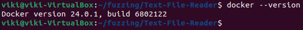
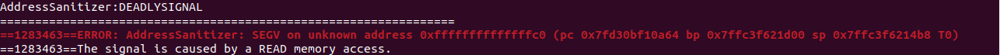
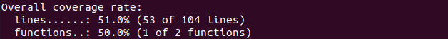
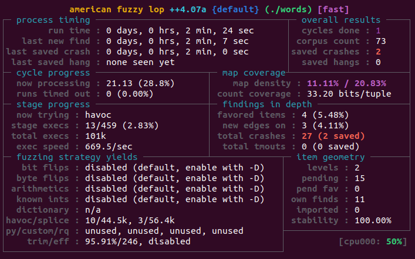

# 2. Фаззинг-тестирование приложения

## Подготовка виртуальной машины

### Установка Docker

1. `sudo apt update`
2. `sudo apt install apt-transport-https ca-certificates curl software-properties-common`
3. `curl -fsSL https://download.docker.com/linux/ubuntu/gpg | sudo gpg --dearmor -o /usr/share/keyrings/docker-archive-keyring.gpg`
4. `echo "deb [arch=$(dpkg --print-architecture) signed-by=/usr/share/keyrings/docker-archive-keyring.gpg] https://download.docker.com/linux/ubuntu $(lsb_release -cs) stable" | sudo tee /etc/apt/sources.list.d/docker.list > /dev/null`
5. `sudo apt update`
6. `sudo apt install docker-ce docker-ce-cli containerd.io`
7. `sudo usermod -aG docker $USER`
8. `docker --version`



### Загрузка образа и запуск контейнера

- `docker pull aflplusplus/aflplusplus`
- `docker run -it aflplusplus/aflplusplus`

## Исходный код

Выберем цель для нашего теста, а так же корпус входных данных:
- `git clone https://github.com/eduardoParedes/Text-File-Reader.git`
- `git clone https://github.com/openpreserve/format-corpus.git`

### Makefile

```Makefile
CC = gcc

TARGET = words 
SOURCES = words.c
OBJECTS = $(SOURCES:.c=.o)

all: $(TARGET)

$(TARGET): $(OBJECTS)
	$(CC) $(OBJECTS) -o $(TARGET)

clean:
	rm -f $(OBJECTS) $(TARGET) *.gcda *.gcno core *~
```

## Сборка и тест проекта с санитайзерами

- `cd text-file-reader`

- `cmake . -D CMAKE_C_COMPILER=afl-cc -D CMAKE_CXX_COMPILER=afl-c++`

- `AFL_USE_ASAN=1 AFL_USE_UBSAN=1 make -j20`

- `find ./input -type f -exec ./words {} \;`

### Результат теста



## Анализ прокрытия кода

- `cd text-file-reader`

- `cmake . -DCMAKE_C_COMPILER=cc -DCMAKE_CXX_COMPILER=g++ -DCMAKE_C_FLAGS="-g -O2 --coverage" -DCMAKE_CXX_FLAGS="-g -O2 --coverage" -DCMAKE_EXE_LINKER_FLAGS="-lgcov"`

`make -j20`

- `find ./input -type f -exec ./words {} \;`

- `lcov -t "words" -o words.info -c -d .`
- `genhtml -o report words.info`

### Результаты анализа



## Фаззинг-тестирование

- `cd text-file-reader`

- `cmake . -D CMAKE_C_COMPILER=afl-cc -D CMAKE_CXX_COMPILER=afl-c++`

- `AFL_USE_ASAN=1 AFL_USE_UBSAN=1 make -j20`

- `afl-fuzz -i /input -o out -t 1000 ./words -f 1 -l 1 -noImage @@`

### Результаты тестов


